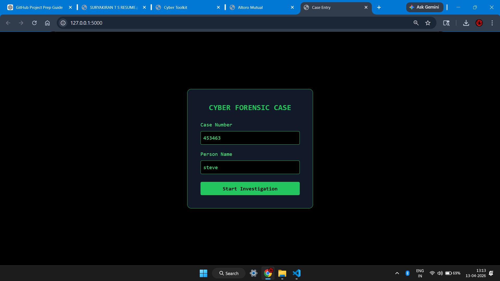
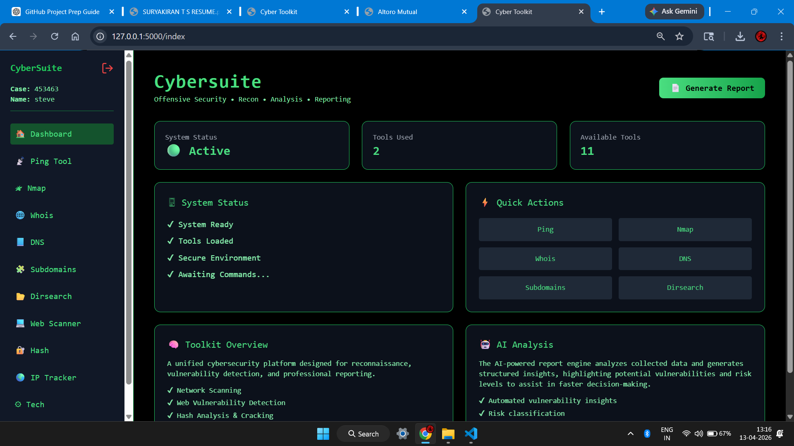
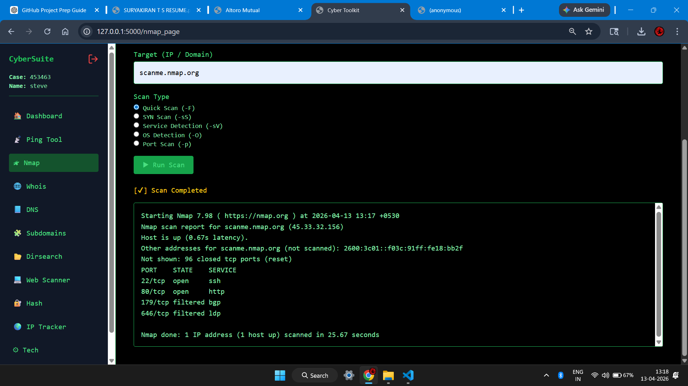
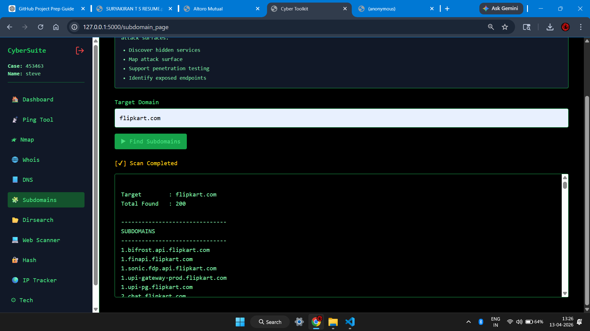
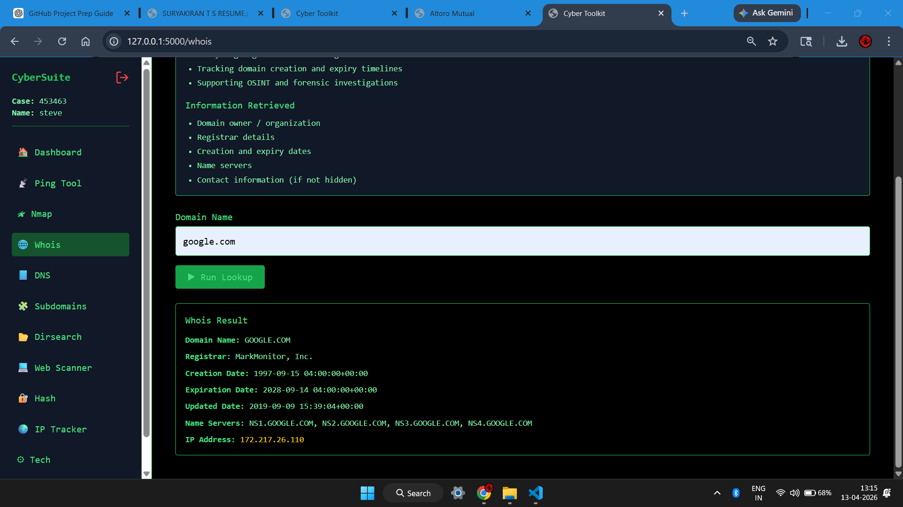
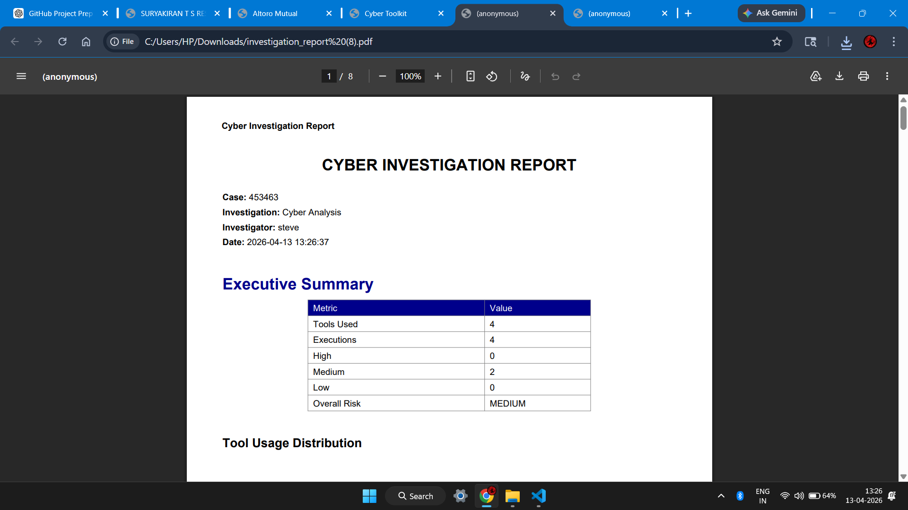

# Cybersecurity Investigation Toolkit

This project is a Flask-based cybersecurity toolkit designed for digital investigation and basic penetration testing tasks. It integrates multiple scanning techniques, system tools, and custom-built modules into a single web interface, along with automated report generation.

---

## Overview

The application allows users to create investigation sessions, run various security tools, and generate structured reports. It combines system-level tools like Nmap with Python-based scanners and an AI-powered reporting component.

---

## Features

* Network scanning using Nmap
* Whois lookup
* DNS enumeration
* Subdomain discovery using Subfinder
* Directory brute-force scanning (custom implementation)
* Web vulnerability scanning
* SQL injection detection (basic)
* Hash generation and cracking
* Ping analysis
* Technology detection
* IP intelligence lookup
* AI-based report generation
* PDF report export

---

## Screenshots

### Case Entry



### Dashboard



### Nmap Scan



### Subdomain Discovery



### Whois Lookup



### AI Report Generation


### Generated Report



---

## Project Structure

```
cyber-toolkit/
│
├── app.py
├── routes/
├── tools/
│   ├── subfinder.exe
│   ├── wordlist.txt
│   ├── *_tool.py
│
├── utils/
├── templates/
├── static/
│
├── docs/
│   └── screenshots/
│
├── requirements.txt
├── README.md
├── .gitignore
```

---

## Installation

### 1. Clone the repository

```
git clone https://github.com/YOUR_USERNAME/cyber-toolkit.git
cd cyber-toolkit
```

---

### 2. Install dependencies

```
pip install -r requirements.txt
```

---

### 3. Configure environment variables

Create a `.env` file in the root directory:

```
SECRET_KEY=your_secret_key_here
GROQ_API_KEY=your_groq_api_key_here
```

---

## Tool Setup

### Subfinder (Required)

Used for subdomain enumeration.

#### Windows

1. Download Subfinder from GitHub releases
2. Extract it
3. Rename to:

```
subfinder.exe
```

4. Place inside:

```
tools/subfinder.exe
```

---

#### Linux

```
sudo apt install subfinder
```

Ensure it is available in PATH.

---

### Nmap (Required)

#### Windows

Install from official Nmap website

#### Linux

```
sudo apt install nmap
```

---

### Ping

No setup required (system built-in command)

---

## Custom Modules

These tools are implemented in Python:

* Directory scanner (uses local wordlist)
* SQL injection scanner
* Web vulnerability scanner
* DNS lookup
* Hash cracking
* Technology detection
* IP lookup

---

## Running the Application

```
python app.py
```

Open:

```
http://127.0.0.1:5000
```

---

## Report Generation

Generates PDF reports from collected scan data.
AI mode includes structured findings, risk levels, and recommendations.

---

## Limitations

* Directory scanning uses a small wordlist
* SQL injection detection is basic
* Depends on external tools (Nmap, Subfinder)
* AI requires internet and API key

---

## Possible Improvements

* Support larger/custom wordlists
* Improve SQL detection logic
* Add tools like sqlmap / ffuf
* Store investigation history (database)
* Add authentication system
* Improve UI responsiveness

---

## Disclaimer

This project is for educational and authorized testing purposes only.

---

## Author

Suryakiran T S
MSc Cyber Forensics
